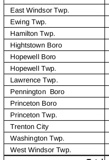
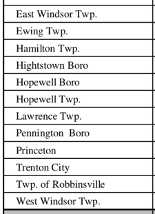

```{r setup, include=FALSE}
knitr::opts_chunk$set(echo = TRUE)
options(kableExtra.html.bsTable = TRUE)
options(digits = 2)
renv::use(
  "tor-gu/njelections@v1.0.0",
  "tor-gu/njmunicipalities@v1.0.0",
  "tidyverse@1.3.2"
)
```
```{r echo=FALSE, message=FALSE}
library(tidyverse)
library(kableExtra)
kbl <- function(tbl, caption) {
  knitr::kable(tbl,
               caption = caption,
               format = "html",
               table.attr = "class=\"kable\"") %>%
    kable_styling(bootstrap_options = c("striped", "hover"))
}
```
## Summary
While building and working with the [njelections](https://github.com/tor-gu/njelections) package, I've found that a number of official results at the municipal level are probably (and in some cases, clearly) wrong ^[Currently, the [njelections](https://github.com/tor-gu/njelections) package always uses official results.] In each case, the error appears to be that the results from alphabetically adjacent towns are transposed.  So far, I've found three examples of this:

* In the [2005 NJ Governor race](#nj-governor-race-egg-harbor-city-egg-harbor-township-and-estell-manor-city), the results for Egg Harbor City, Egg Harbor Township, and Estell Manor appear to be scrambled.
* In the [2006 US Senate rate](#us-senate-race-egg-harbor-city-and-egg-harbor-township), the results for Egg Harbor City and Egg Harbor Township appear to be transposed.
* In the [2013 NJ Governor race](#nj-governors-race-trenton-and-robbinsville), the results for Trenton and Robbinsville appear to be partially transposed.

In the following sections, I'll explain why I think the official results are wrong, and how I suspect they should be fixed.


## Egg Harbor City, Egg Harbor Township, and Estell Manor, 2005-2006
```{r echo=FALSE}
# We'll use this repeatedly in the next couple of sections
library(njelections)
egg_estell_summary <- election_by_municipality |>
  filter(municipality %in% c("Estell Manor city", "Egg Harbor City city", "Egg Harbor township")) |>
  mutate(municipality = str_remove_all(municipality, " city")) |>
  select(year, municipality, office, party, vote) |>
  mutate(party = factor(party)) |>
  mutate(party = fct_other(party, 
                           keep = c("Democratic", "Republican"), 
                           other_level = "Third Party")) |>
  group_by(year, municipality, office, party) |>
  summarize(vote=sum(vote), .groups="drop") |>
  arrange(municipality)
```
Before I get to the incorrect results in 2005 and 2006, let's take a look at how these three towns usually vote. Here are the [official results](https://nj.gov/state/elections/assets/pdf/election-results/2009/2009-governor_results-atlantic.pdf) for the *2009* NJ Governor's race, which I have no reason to suspect are incorrect:

```{r echo=FALSE}
results_2009 <- egg_estell_summary |>
  filter(year == 2009) |>
  pivot_wider(names_from="party", values_from="vote") |>
  arrange(municipality) |>
  mutate(population=c(4243,43323,1735)) |>
  relocate(year, municipality, population)
results_2009 |> kbl("2009 NJ Governor's race, official results, with 2010 population")
```
Egg Harbor township is by far the largest town, and has larger vote totals across the board. Egg Harbor city is larger than Estell Manor and more Democratic.


### 2005 NJ Governor race: Egg Harbor City, Egg Harbor township, and Estell Manor City
Now let's take a look at the 2005 Governor's race.  Here are the  [official results](https://nj.gov/state/elections/assets/pdf/election-results/2005/2005governor's_results-atlantic.pdf):

```{r echo=FALSE}
results_2005 <- egg_estell_summary |>
  filter(year == 2005) |>
  pivot_wider(names_from="party", values_from="vote")

results_2005 |> kbl("2005 NJ Governor's race, official results")
```
Clearly, these results cannot be correct. The Republican vote in Estell Manor, for example, exceeds the population by a factor of more than 2.

My suspicion is that the results are shuffled, and the correct results should look like this:
```{r echo = FALSE}
fixed_results_2005 <- tribble(
  ~year, ~municipality, ~Democratic, ~Republican, ~`Third Party`,
  2005, "Egg Harbor City", 532, 409, 78,
  2005, "Egg Harbor township", 4202, 4187, 309,
  2005, "Estell Manor", 291, 382, 40,
)
fixed_results_2005 |> kbl("2005 NJ Governor's race, possible corrections")
```
The corrected third party vote for the two smaller towns is a bit of guesswork. The third party vote in Egg Harbor City usually runs ahead of the third party vote in the smaller Estell Manor, so this guess is reasonable. On the other hand, I have lumped together all third party candidates, under the assumption that they were swapped as a group, which is far from certain.

### 2006 US Senate Race: Egg Harbor City and Egg Harbor township
Now let's turn to the 2006 Senate rate. Here are the [official results](https://nj.gov/state/elections/assets/pdf/election-results/2006/2006-senate-atlantic-final.pdf):
```{r echo=FALSE}
results_2006 <- egg_estell_summary |>
  filter(year == 2006) |>
  pivot_wider(names_from="party", values_from="vote")
results_2006 |> kbl("2006 US Senate race, official results")
```
In this case, the Estell Manor results seem very plausible, while the results from Egg Harbor City and Egg Harbor township seem to have swapped. 

I suspect the correct results should look like this:
```{r echo=FALSE}
results_2006_corrected <- 
  results_2006 |> mutate(
    municipality = case_when(
      municipality == "Egg Harbor City" ~ "Egg Harbor township",
      municipality == "Egg Harbor township" ~ "Egg Harbor City",
      TRUE ~ municipality
    )
  ) |>
  arrange(municipality)
results_2006_corrected |> kbl("2006 US Senate race, possible corrections")

```

Evidently, these three towns are difficult to keep straight! One might wonder if this is the only time the results have been scrambled. Fortunately, 2005 (Governor) and 2006 (Senate) seem to be the only election years between 2004 and 2021 which stand out as having a *clear* mistake:
```{r echo = FALSE}
egg_estell_summary |>
  filter(party %in% c("Democratic", "Republican")) |>
  group_by(year, municipality, office, party) |>
  summarize(vote=sum(vote), .groups="drop") |>
  ggplot(aes(x=year, y=vote)) +
  geom_line(aes(color=municipality)) +
  facet_grid(cols=vars(party), rows=vars(office),
             scales="free_y") +
  theme(legend.position = "bottom", legend.title = element_blank()) +
  labs(title="Official Election Results In Three Atlantic County Towns, 2004-2021", 
       subtitle="The results in 2005 and 2006 appear to be incorrect",
       caption="Source: New Jersey Division of Elections via tor-gu/njelections",
       legend.title = "'")


```

## 2013 NJ Governor's race, Trenton and Robbinsville

### Initial results
```{r echo=FALSE}
# We'll use this several times
library(njmunicipalities)
t_r_summary <- njmunicipalities::get_geoid_cross_references(2021,2004:2021) |>
  left_join(get_municipalities(2021), by=c("GEOID_ref"="GEOID")) |>
  filter(municipality %in% c("Trenton city", "Robbinsville township")) |>
  mutate(municipality = str_remove_all(municipality, " city")) |>
  mutate(municipality = str_remove_all(municipality, " township")) |>
  select(year, GEOID, municipality) |> 
  inner_join(
    select(election_by_municipality, -municipality, -county), 
    by=c("year", "GEOID"))|>
  select(year, municipality, office, party, vote) |>
  mutate(party = factor(party)) |>
  mutate(party = fct_other(party, 
                           keep = c("Democratic", "Republican"), 
                           other_level = "Third Party")) |>
  group_by(year, municipality, office, party) |>
  summarize(vote=sum(vote), .groups="drop") |>
  arrange(municipality)
```
New Jersey released the official results for Mercer County twice.  Here is how the results were [initially released](https://nj.gov/state/elections/assets/pdf/election-results/2013/2013-general-election-results-governor-mercer.pdf):
```{r echo=FALSE}
t_r_summary_orig <- t_r_summary |>
  mutate(vote = case_when(
    year == "2013" & municipality == "Robbinsville" & party == "Democratic" ~ 9179L,
    year == "2013" & municipality == "Trenton" & party == "Democratic" ~ 1228L,
    TRUE ~ vote
  ))
t_r_summary_orig |> filter(year == 2013) |>
  pivot_wider(names_from="party", values_from="vote") |>
  kbl("2013 Governor race, initial official results (later revised)")
```
The Democratic vote stands out as clearly incorrect -- Trenton is large and Democratic, while Robbinsville is small and Republican.  But the Republican and Third party votes are also out of character.
```{r echo=FALSE}
t_r_summary_orig |> 
  ggplot(aes(x=year, y=vote)) +
  geom_line(aes(color=municipality)) +
  facet_grid(cols=vars(office), rows=vars(party), scales="free_y") +
  theme(legend.position = "bottom")
```

### Revised results
In the [revised (and current) official results](https://nj.gov/state/elections/assets/pdf/election-results/2013/2013-general-election-results-governor-mercer-0131.pdf), the Democratic votes for Trenton and Robbinsville are swapped:
```{r echo=FALSE}
t_r_summary |> filter(year == 2013) |>
  pivot_wider(names_from="party", values_from="vote") |>
  kbl("2013 Governor race, official results (revised)")
```
This is more plausible, but leaves the at least somewhat out-of-character Republican and third-party vote in place.

### Proposed changes
I suspect that in the initial results, *all* of the vote counts -- not just the Democratic ones -- in Robbinsville and Trenton were transposed. Here are my suggested fixes:
```{r echo=FALSE}
t_r_summary_fixed <- t_r_summary |>
  mutate(vote = case_when(
    year == "2013" & municipality == "Robbinsville" & party == "Republican" ~ 3035L,
    year == "2013" & municipality == "Trenton" & party == "Republican" ~ 2102L,
    year == "2013" & municipality == "Robbinsville" & party == "Third Party" ~ 77L,
    year == "2013" & municipality == "Trenton" & party == "Third Party" ~ 136L,
    TRUE ~ vote
  ))
t_r_summary_fixed |> filter(year == 2013) |>
  pivot_wider(names_from="party", values_from="vote") |>
  kbl("2013 Governor race, possible corrections")
```

If you make this change, the 2013 vote for both towns is more in character for with previous and subsequent elections:
```{r echo=FALSE}
bind_rows(
  t_r_summary_orig |> filter(office=="Governor") |>
    mutate(version="Official (original)"),
  t_r_summary |> filter(office=="Governor") |>
    mutate(version="Official (revised)"),
  t_r_summary_fixed |> filter(office=="Governor") |>
    mutate(version="Suggested Fix"),
) |>
  ggplot(aes(x=year, y=vote)) +
  geom_line(aes(color=municipality)) +
  facet_grid(cols=vars(version), rows=vars(party), scales="free_y") +
  theme(legend.position = "bottom", legend.title = element_blank()) +
  labs(title="Preliminary and Revised Official Election Results In NJ Governor Race, 2005-2021, Robbinsville and Trenton",
       subtitle="Including a suggested fix for 2013",
       caption="Source: New Jersey Division of Elections via tor-gu/njelections")
```

### Robbinsville township name change
In the case of Robbinsville and Trenton, there is a fairly plausible mechanism for how the the votes could have been transposed: Between the 2009 and 2013 NJ Governor elections, the township changed its official name from Washington to Robbinsville, and as a result, Trenton and Washington/Robbinsville switched positions in a alphabetic listing of Mercer County towns.

If you think that is too trivial a consideration to affect a the official tally of the NJ Governor's election, I would like to direct your attention to the PDFs of the official results.  

Here is how that list appears in [2009](https://nj.gov/state/elections/assets/pdf/election-results/2009/2009-governor_results-mercer.pdf). Notice that the list is alphabetized, with "Washington Twp." appearing just after "Trenton City".  All townships have the "Twp." suffix.




And now the same list in [2013](https://nj.gov/state/elections/assets/pdf/election-results/2013/2013-general-election-results-governor-mercer-0131.pdf). You would expect to see "Robbinsville Twp." just before "Trenton City". Instead, "Twp." is *prepended* to "Robbinsville", allowing the township to appear in the same position in the list, just *after* Trenton.



Lucky thing it wasn't a borough. 

Anyway, I have sympathy. Dealing with heterogeneous data sets from multiple sources is hard.
